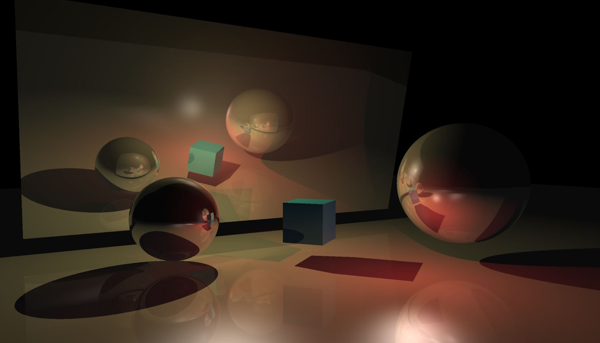

# CUDA Raytracer

This repo contains the source code for a simple raytracer written in CUDA.
I originally wrote it in Visual Studio 2010 for my master's thesis; the original version control history got lost.
The code has since been updated to compile with Visual Studio 2022 and CUDA 12.4.

The raytracer supports triangles and spheres only.
Lights, shadows, and reflections are calculated up to a recursion depth of 6.
On a GeForce 1060, the scene from the screenshot below is rendered with 60fps in a resolution of 2560x1440 pixels.

_The raytraced scene with three lights and multiple reflecting objects._
